# Developer Notes — Loupe 24K

Technical reference for developers working on the Loupe 24K ERPNext customization.

---

## Stack

| Component | Version | Role |
|---|---|---|
| ERPNext | v15 | Base ERP platform |
| Frappe Framework | v15 | Web framework (Python + JS) |
| MariaDB | 10.6 | Primary database |
| Redis | 7 | Cache + background job queue |
| nginx | (bundled) | Reverse proxy / static assets |
| Node.js | (bundled) | Socket.IO websocket server |

---

## Repository Layout

```
loupe24k/
├── Dockerfile                   # Extends frappe/erpnext:version-15, pip-installs loupe24k
├── docker-compose.yml           # Full-stack service definition
├── Makefile                     # Dev workflow shortcuts
├── .env                         # Local secrets (gitignored)
└── apps/
    └── loupe24k/                # Frappe app root
        ├── setup.py
        ├── requirements.txt
        └── loupe24k/            # Python package
            ├── hooks.py         # Frappe extension points
            ├── modules.txt      # "Loupe 24K"
            ├── setup/
            │   └── install.py   # after_install / after_migrate — creates custom fields
            ├── data/
            │   └── seed_data.py # Idempotent master data seed
            └── loupe_24k/       # Frappe module (Loupe 24K → loupe_24k)
                ├── doctype/
                │   ├── fine_gold_ledger_entry/
                │   ├── stone_ledger_entry/
                │   ├── stone_master/
                │   ├── stone_lot/
                │   ├── metal_rate/
                │   ├── karigar_metal_issue/         # + _item and _stone child tables
                │   ├── karigar_reconciliation/      # + _item child table
                │   ├── scrap_recovery_entry/        # + _item child table
                │   └── hallmarking_register/
                └── workspace/
                    └── loupe_24k/
                        └── loupe_24k.json           # Workspace layout (loaded by bench migrate)
```

---

## First-Time Setup

### Prerequisites
- Docker Desktop (Engine ≥ 23)
- `make`

### Steps

**1. Configure secrets**

Edit `.env` and set strong passwords before anything else:

```bash
DB_PASSWORD=...
ADMIN_PASSWORD=...
```

**2. Add the hostname** (once per machine)

```bash
echo "127.0.0.1  loupe24k.localhost" | sudo tee -a /etc/hosts
```

**3. Run the all-in-one installer**

```bash
make install        # build image → start services → create site → seed data (~10-20 min)
```

This is equivalent to running `make build && make start && make setup-site && make seed` in sequence. `setup-site` also triggers `after_install` (creates all custom fields automatically) and enables developer mode. At the end, the installer prints the site URL and credentials as a reminder.

**4. Open the browser**

```
http://loupe24k.localhost:8080
Username: Administrator
Password: (value of ADMIN_PASSWORD in .env)
```

---

## Daily Workflow

```bash
make start          # start all services
make stop           # stop all services
make restart        # restart all services
make logs           # tail logs from all containers
make migrate        # run bench migrate (loads workspace JSON, custom fields, patches)
make seed           # re-seed master data (idempotent, safe to re-run)

make shell          # bash into the backend container
make bench CMD="list-apps --site loupe24k.localhost"
```

---

## Applying Code Changes

### Python / server-side

After editing files under `apps/loupe24k/`:

```bash
# Option A — rebuild image (clean, recommended after structural changes)
make build && make restart

# Option B — hot-copy a single file into the running container (fastest for logic tweaks)
# The apps/ directory is baked into the image; bind-mounts only cover sites/ and logs/.
docker cp apps/loupe24k/loupe24k/data/seed_data.py \
    loupe24k-backend-1:/home/frappe/frappe-bench/apps/loupe24k/loupe24k/data/seed_data.py
# Then re-run the affected command (e.g. make seed). Changes are lost on container restart.

# Option C — migrate only (DocType schema, workspace JSON, custom fields, patches)
make migrate
```

### JS / CSS

```bash
make shell
bench --site loupe24k.localhost build --app loupe24k
```

### Custom fields

Custom fields are defined in `setup/install.py` under `CUSTOM_FIELDS`. Edit that dict, then:

```bash
make migrate
```

`after_migrate` calls `create_custom_fields()` which is idempotent — safe to run repeatedly.

### DocType schema changes (new fields via UI)

1. Edit in Frappe Desk (Customize Form or DocType editor)
2. Export: `bench --site loupe24k.localhost export-fixtures`
3. Commit the JSON under `apps/loupe24k/loupe24k/loupe_24k/doctype/<name>/`

---

## Custom DocTypes Reference

All DocTypes live in the `Loupe 24K` module (`loupe_24k/doctype/`).

### Submittable documents (have a workflow state)

| DocType | Series | Purpose |
|---|---|---|
| Fine Gold Ledger Entry | `FGL-.YYYY.-.#####` | One row per fine-gold movement |
| Stone Ledger Entry | `SLE-.YYYY.-.#####` | One row per stone movement |
| Karigar Metal Issue | `KMI-.YYYY.-.#####` | Job-work challan (metal + stones to karigar) |
| Karigar Reconciliation | `KREC-.YYYY.-.#####` | Settles a challan; checks wastage vs allowance |
| Scrap Recovery Entry | `SRE-.YYYY.-.#####` | Sends scrap to refiner; credits recovered fine gold |
| Hallmarking Register | `HUID-.YYYY.-.#####` | Per-piece HUID and hallmark details |

### Master records

| DocType | Naming | Purpose |
|---|---|---|
| Stone Master | by `stone_name` | Stone type definition |
| Stone Lot | `SLOT-.YYYY.-.#####` | Specific parcel or serial stone |
| Metal Rate | `MR-.YYYY.-.#####` | Daily karat-wise gold rate |

### Child tables (embedded in parent documents)

| Child DocType | Parent |
|---|---|
| Karigar Metal Issue Item | Karigar Metal Issue |
| Karigar Metal Issue Stone | Karigar Metal Issue |
| Karigar Reconciliation Item | Karigar Reconciliation |
| Scrap Recovery Item | Scrap Recovery Entry |

---

## DocType Relationship Diagram

```mermaid
erDiagram

    %% ── Masters ──────────────────────────────────────────────────────────────
    STONE_MASTER ||--o{ STONE_LOT : "defines"
    METAL_RATE   }o--o| METAL_RATE : "derives-from (24K master)"

    %% ── Karigar Issue ────────────────────────────────────────────────────────
    KARIGAR_METAL_ISSUE ||--|{ KARIGAR_METAL_ISSUE_ITEM   : "contains"
    KARIGAR_METAL_ISSUE ||--|{ KARIGAR_METAL_ISSUE_STONE  : "contains"
    KARIGAR_METAL_ISSUE }o--|| SUPPLIER                   : "issued-to (karigar)"
    KARIGAR_METAL_ISSUE_ITEM  }o--|| ITEM                 : "references"
    KARIGAR_METAL_ISSUE_STONE }o--|| STONE_LOT            : "references"

    %% ── Karigar Reconciliation ───────────────────────────────────────────────
    KARIGAR_RECONCILIATION ||--|{ KARIGAR_RECONCILIATION_ITEM : "contains"
    KARIGAR_RECONCILIATION }o--|| KARIGAR_METAL_ISSUE         : "settles"

    %% ── Scrap Recovery ───────────────────────────────────────────────────────
    SCRAP_RECOVERY_ENTRY ||--|{ SCRAP_RECOVERY_ITEM : "contains"
    SCRAP_RECOVERY_ENTRY }o--|| SUPPLIER            : "sent-to (refiner)"

    %% ── Hallmarking ──────────────────────────────────────────────────────────
    HALLMARKING_REGISTER }o--|| SERIAL_NO : "records HUID on"
    SERIAL_NO            }o--|| ITEM      : "instance-of"

    %% ── Standard manufacturing flow ──────────────────────────────────────────
    WORK_ORDER   }o--|| BOM        : "uses"
    STOCK_ENTRY  }o--|| WORK_ORDER : "against"
    JOB_CARD     }o--|| WORK_ORDER : "against"

    %% ── Sales documents ──────────────────────────────────────────────────────
    QUOTATION      ||--|{ QUOTATION_ITEM      : "contains"
    SALES_INVOICE  ||--|{ SALES_INVOICE_ITEM  : "contains"
    QUOTATION_ITEM     }o--|| ITEM            : "references"
    SALES_INVOICE_ITEM }o--|| ITEM            : "references"

    %% ── Fine Gold Ledger postings ────────────────────────────────────────────
    KARIGAR_METAL_ISSUE    ||--o{ FINE_GOLD_LEDGER_ENTRY : "posts-to"
    KARIGAR_RECONCILIATION ||--o{ FINE_GOLD_LEDGER_ENTRY : "posts-to"
    SCRAP_RECOVERY_ENTRY   ||--o{ FINE_GOLD_LEDGER_ENTRY : "posts-to"
    STOCK_ENTRY            ||--o{ FINE_GOLD_LEDGER_ENTRY : "posts-to"

    %% ── Stone Ledger postings ────────────────────────────────────────────────
    KARIGAR_METAL_ISSUE    ||--o{ STONE_LEDGER_ENTRY : "posts-to"
    KARIGAR_RECONCILIATION ||--o{ STONE_LEDGER_ENTRY : "posts-to"
    STONE_LOT              ||--o{ STONE_LEDGER_ENTRY : "tracked-in"
```



**Reading the diagram**

| Notation | Meaning |
|---|---|
| `\|\|--\|{` | One-to-many, both sides mandatory (child table embedded in parent) |
| `}o--\|\|` | Many-to-one Link field (foreign key) |
| `\|\|--o{` | One-to-many posting relationship |
| `}o--o\|` | Optional self-reference (Metal Rate derives from 24K master) |

---

## Custom Fields on Standard DocTypes

Defined in `setup/install.py → CUSTOM_FIELDS`. Applied automatically on `bench migrate`.

| Standard DocType | Fields added |
|---|---|
| Item | `metal_type`, `karat`, `touch`, `is_stone`, `carat_wt`, `fine_wt`, `cert_no` |
| BOM | `target_touch`, `wastage_pct`, `expected_setting_loss_pct`, `scrap_by_products` |
| Work Order | `karat`, `expected_metal_in`, `expected_fine_gold` |
| Stock Entry | `weight_in`, `weight_out`, `scrap_wt`, `loss_wt`, `karigar`, `stone_in`, `stone_set`, `stone_broken` |
| Job Card | same weight + stone fields as Stock Entry |
| Serial No | `huid`, `gross_wt`, `purity`, `hallmark_date` |
| Quotation Item | `metal_value`, `making_charge`, `wastage_charge`, `stone_value`, `old_gold_adjustment` |
| Sales Invoice Item | same pricing fields as Quotation Item |
| Supplier | `is_karigar`, `wastage_allowance_pct`, `breakage_allowance_pct`, `making_rate`, `current_metal_balance` |

---

## Seed Data

Defined in `data/seed_data.py`. Run via `make seed` or:

```bash
make bench CMD="--site loupe24k.localhost execute loupe24k.data.seed_data.seed"
```

| Section | What gets created |
|---|---|
| Company | Loupe 24K (`L24K`) with Standard CoA, Indian FY, Global Defaults, Stock Settings — skipped if a company already exists. Creates Warehouse Type `Transit` first (needed for Goods In Transit). |
| UOMs | Gram, Milligram, Carat, Piece, Cent |
| Item Groups | Raw Metal, WIP-Metal, Finished Jewellery, Stones, Recoverable Scrap, Refinable Scrap, Consumables |
| Item Attributes | Karat, Ring Design, Ring Size, Stone Shape, Stone Quality |
| Warehouses | Vault, WIP stages, Karigar locations, Hallmarking, Finished Goods, Stone Store, Scrap Store |
| Workstations | Melting Furnace, Casting Station, Filing Bench, Polishing Wheel, Setting Bench, QC Bench, Hallmarking Station |
| Operations | Alloying, Casting, Filing, Polishing, Stone Setting, QC Inspection, Hallmarking |
| Items | Pure Gold 24K, Silver Alloy, 22K Grain, Ring Blanks, Finished Rings (22K + 24K), Scrap items, Consumables |
| Stones | Round Diamond (lot), Certified Solitaire (serial); lots MELEE-001 (30pc, 0.75ct) and SOL-001 (0.30ct, GIA) |
| Parties | Ramesh Karigar (2% allowance), Suresh Setter (5% breakage), Anand Refinery, BIS Hallmark Centre, Mumbai Bullion House, Rajwadi Jewellers |
| Metal Rate | 24K seed rate: ₹6,200/g |
| Workspace | **Loupe 24K** public workspace with 4 shortcuts and 9 DocTypes grouped into Masters, Karigar Operations, Scrap & Hallmarking, and Ledgers cards. Recreated on every `make seed` run. |

All inserts use `ignore_if_duplicate=True` — safe to run on a populated site.

---

## Touch Factors

| Karat | Touch | Basis |
|---|---|---|
| 24K | 1.0000 | Pure gold reference |
| 22K | 0.9167 | 22 ÷ 24 |
| 18K | 0.7500 | 18 ÷ 24 |

`fine_wt = gross_wt × touch` — computed automatically in all DocType controllers and custom field logic.

---

## Business Logic in Controllers

| File | Key logic |
|---|---|
| `fine_gold_ledger_entry.py` | `fine_wt = gross_wt × touch` on validate |
| `metal_rate.py` | Sets touch; derives rate from 24K master if `derived_from_24k` is checked |
| `stone_lot.py` | `total_value = rate_per_ct × total_carat` |
| `karigar_metal_issue.py` | Sums child-table totals; auto-sets `due_back_date` = dispatch + 1 year; sets status on submit |
| `karigar_reconciliation.py` | Pulls issued weights from challan; calculates fine loss vs allowance; checks stone breakage; sets verdict (Pass / Warning / Fail) |
| `scrap_recovery_entry.py` | `fine_recovered = total_est_fine_wt × recovery_pct / 100` |

---

## Adding a Database Migration (Patch)

1. Create `apps/loupe24k/loupe24k/patches/vX_Y/your_patch.py`
2. Add the dotted path to `apps/loupe24k/loupe24k/patches.txt`
3. Run: `make migrate`

---

## Adding Python Dependencies

Add to `apps/loupe24k/requirements.txt`, then:

```bash
make build && make restart
```

---

## Docker Services Reference

| Service | Role |
|---|---|
| `configurator` | One-shot init: writes bench global config, then exits |
| `backend` | Gunicorn WSGI (port 8000, internal) |
| `frontend` | nginx reverse proxy (port 8080, published) |
| `websocket` | Node.js Socket.IO (port 9000, internal) |
| `queue-short` | Background worker — short + default queues |
| `queue-long` | Background worker — long queue |
| `scheduler` | Frappe scheduled tasks |
| `db` | MariaDB 10.6 |
| `redis-cache` | Page and query cache |
| `redis-queue` | Job queue + Socket.IO pub/sub (persisted) |

---

## Danger Zone

```bash
make reset-site     # drop and recreate the site (data loss)
make nuke           # remove all containers AND volumes (total reset)
```

---

## Useful Bench Commands

```bash
# App management
bench list-apps
bench install-app loupe24k
bench --site loupe24k.localhost migrate

# Seed data
bench --site loupe24k.localhost execute loupe24k.data.seed_data.seed

# Console (Python REPL with Frappe context)
bench --site loupe24k.localhost console

# Build JS/CSS assets
bench build --app loupe24k

# Run tests
bench --site loupe24k.localhost run-tests --app loupe24k

# Export fixtures after UI changes
bench --site loupe24k.localhost export-fixtures
```

---

## Frappe Hooks Reference

Key hooks wired in `hooks.py`:

| Hook | Points to | When it fires |
|---|---|---|
| `after_install` | `loupe24k.setup.install.after_install` | Once, when `bench install-app loupe24k` runs |
| `after_migrate` | `loupe24k.setup.install.after_migrate` | On every `bench migrate` |

Full Frappe hooks reference: https://frappeframework.com/docs/v15/user/en/python-api/hooks
